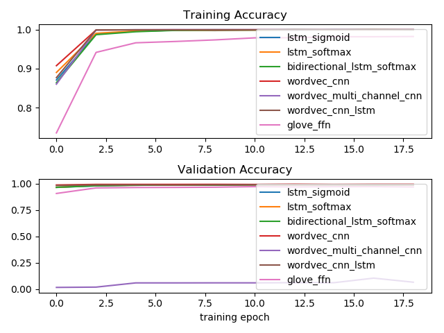

# keras-sentiment-analysis-web-api

Web api built on flask for keras-based sentiment analysis using Word Embedding, RNN and CNN

The implementation of the classifiers can be found in [keras_sentiment_analysis/library](keras_sentiment_analysis/library)

* [cnn.py](keras_sentiment_analysis/library/cnn.py)
    * 1-D CNN with Word Embedding 
    * Multi-Channel CNN with categorical cross-entropy loss function

* [cnn_lstm.py](keras_sentiment_analysis/library/cnn_lstm.py)
    * 1-D CNN + LSTM with Word Embedding

* [ffn.py](keras_sentiment_analysis/library/ffn.py)
    * Feedforward network with Glove Word Embedding

* [lstm.py](keras_sentiment_analysis/library/lstm.py)
    * LSTM with binary or category cross-entropy loss function
    * Bi-directional LSTM/GRU with categorical cross-entropy loss function


# Usage

Run the following command to install the keras, flask and other dependency modules:

```bash
sudo pip install -r requirements.txt
```

## Training (Optional)

As the trained models are already included in the [demo/models](demo/models) folder in the project, the training is
not required. However, if you like to tune the parameters and retrain the models, you can use the 
following command to run the training:

```bash
cd demo
python wordvec_bidirectional_lstm_softmax_train.py
```

Below shows the sample code in [wordvec_bidirectional_lstm_softmax_train.py](demo/wordvec_bidirectional_lstm_softmax_train.py):

```python
import numpy as np
import os 
import sys 


def main():
    random_state = 42
    np.random.seed(random_state)
    
    current_dir = os.path.dirname(__file__)
    # this line ask sys to add the keras_sentiment_analysis module to system path
    sys.path.append(os.path.join(current_dir, '..')) 
    current_dir = current_dir if current_dir is not '' else '.'

    output_dir_path = current_dir + '/models'
    data_file_path = current_dir + '/data/umich-sentiment-train.txt'
    
    from keras_sentiment_analysis.library.lstm import WordVecBidirectionalLstmSoftmax
    from keras_sentiment_analysis.library.utility.simple_data_loader import load_text_label_pairs
    from keras_sentiment_analysis.library.utility.text_fit import fit_text

    text_data_model = fit_text(data_file_path)
    text_label_pairs = load_text_label_pairs(data_file_path)

    classifier = WordVecBidirectionalLstmSoftmax()
    batch_size = 64
    epochs = 20
    history = classifier.fit(text_data_model=text_data_model,
                             model_dir_path=output_dir_path,
                             text_label_pairs=text_label_pairs,
                             batch_size=batch_size, epochs=epochs,
                             test_size=0.3,
                             random_state=random_state)


if __name__ == '__main__':
    main()
```

The above commands will train bidrectional lstm model with softmax activation on the "demo/data/umich-sentiment-train.txt" 
dataset and store the trained model in [demo/models/bidirectional_lstm_softmax_**](demo/models)

If you like to train other models, you can use the same command above on another train python scripts:

* [wordvec_cnn_lstm_train.py](demo/wordvec_cnn_lstm_train.py): cnn + lstm model with softmax and categorical crossentropy objective
* [wordvec_lstm_softmax_train.py](demo/wordvec_lstm_softmax_train.py): lstm model with softmax and categorical crossentropy objective
* [wordvec_lstm_sigmoid_train.py](demo/wordvec_lstm_sigmoid_train.py): lstm model with sigmoid and binary crossentropy objective
* [wordvec_cnn_train.py](demo/wordvec_cnn_train.py): cnn model with softmax and categorical crossentropy objective
* [wordvec_multi_channel_cnn_train.py](demo/wordvec_multi_channel_cnn_train.py): multi-channel cnn model with softmax and categorical crossentropy objective
* [wordvec_glove_ffn_train.py](demo/wordvec_glove_ffn_train.py): glove word embedding layer with feed forward network model and categorical crossentropy objective

The figure below compare the training accuracy and validation accuracy of various models using the script [wordvec_compare_models.py](demo/wordvec_compare_models.py):



## Predict Sentiments

With the trained models in [demo/models](demo/models), one can test the performance by running the predictors via the 
following command:

```bash
cd demo
python wordvec_bidirectional_lstm_softmax_predict.py
```

Below shows the sample code in [wordvec_bidirectional_lstm_softmax_predict.py](demo/wordvec_bidirectional_lstm_softmax_predict.py):

```python
from random import shuffle

import numpy as np
import os 
import sys 


def main():
    random_state = 42
    np.random.seed(random_state)
    
    current_dir = os.path.dirname(__file__)
    # this line ask sys to add the keras_sentiment_analysis module to system path
    sys.path.append(os.path.join(current_dir, '..')) 
    current_dir = current_dir if current_dir is not '' else '.'

    model_dir_path = current_dir + '/models'
    data_file_path = current_dir + '/data/umich-sentiment-train.txt'
    
    from keras_sentiment_analysis.library.lstm import WordVecBidirectionalLstmSoftmax
    from keras_sentiment_analysis.library.utility.simple_data_loader import load_text_label_pairs

    text_label_pairs = load_text_label_pairs(data_file_path)

    classifier = WordVecBidirectionalLstmSoftmax()
    classifier.load_model(model_dir_path=model_dir_path)

    shuffle(text_label_pairs)

    for i in range(20):
        text, label = text_label_pairs[i]
        print('Output: ', classifier.predict(sentence=text))
        predicted_label = classifier.predict_class(text)
        print('Sentence: ', text)
        print('Predicted: ', predicted_label, 'Actual: ', label)


if __name__ == '__main__':
    main()
```

Below is the console print out from running the prediction scripts above:

```
Output:  [  5.74236214e-09   1.00000000e+00]
Sentence:  by the way, the Da Vinci Code sucked, just letting you know...
Predicted:  0 Actual:  0
Output:  [  2.50778981e-10   1.00000000e+00]
Sentence:  , she helped me bobbypin my insanely cool hat to my head, and she laughed at my stupid brokeback mountain cowboy jokes..
Predicted:  0 Actual:  0
Output:  [  1.00000000e+00   2.23617502e-09]
Sentence:  I love Harry Potter..
Predicted:  1 Actual:  1
Output:  [  5.44211538e-08   1.00000000e+00]
Sentence:  Oh, and Brokeback Mountain is a TERRIBLE movie...
Predicted:  0 Actual:  0
Output:  [  1.00000000e+00   2.92380893e-08]
Sentence:  I love The Da Vinci Code...
Predicted:  1 Actual:  1
Output:  [  1.00000000e+00   2.23617502e-09]
Sentence:  I love Harry Potter..
Predicted:  1 Actual:  1
Output:  [  1.53129953e-08   1.00000000e+00]
Sentence:  Is it just me, or does Harry Potter suck?...
Predicted:  0 Actual:  0
Output:  [  1.00000000e+00   1.66275674e-10]
Sentence:  I am going to start reading the Harry Potter series again because that is one awesome story.
Predicted:  1 Actual:  1
Output:  [  2.50778981e-10   1.00000000e+00]
Sentence:  , she helped me bobbypin my insanely cool hat to my head, and she laughed at my stupid brokeback mountain cowboy jokes..
Predicted:  0 Actual:  0
Output:  [  1.00000000e+00   1.62028765e-10]
Sentence:  So as felicia's mom is cleaning the table, felicia grabs my keys and we dash out like freakin mission impossible.
Predicted:  1 Actual:  1
Output:  [  1.12964793e-08   1.00000000e+00]
Sentence:  friday hung out with kelsie and we went and saw The Da Vinci Code SUCKED!!!!!
Predicted:  0 Actual:  0
Output:  [  1.00000000e+00   1.53758450e-10]
Sentence:  I want to be here because I love Harry Potter, and I really want a place where people take it serious, but it is still so much fun.
Predicted:  1 Actual:  1
Output:  [  6.24366930e-06   9.99993801e-01]
Sentence:  Mission Impossible III-Sucks big-time!..
Predicted:  0 Actual:  0
Output:  [  1.00000000e+00   1.35581537e-08]
Sentence:  I, too, like Harry Potter..
Predicted:  1 Actual:  1
Output:  [  1.00000000e+00   9.90327020e-09]
Sentence:  Mission Impossible 3 was excellent.
Predicted:  1 Actual:  1
Output:  [  1.00000000e+00   1.71147096e-08]
Sentence:  Brokeback Mountain was awesome.
Predicted:  1 Actual:  1
Output:  [  1.81291909e-07   9.99999762e-01]
Sentence:  I hate Harry Potter.
Predicted:  0 Actual:  0
Output:  [  1.62805947e-07   9.99999881e-01]
Sentence:  We watched Brokeback Mountain, which was pretty horrible.
Predicted:  0 Actual:  0
Output:  [  1.00000000e+00   2.25338703e-09]
Sentence:  I liked the first " Mission Impossible.
Predicted:  1 Actual:  1
Output:  [  1.00000000e+00   1.01891420e-08]
Sentence:  Mission Impossible is an awesome movie, watch it...
Predicted:  1 Actual:  1
```

Other demo scripts for various classifiers include:

* [wordvec_cnn_lstm_predict.py](demo/wordvec_cnn_lstm_predict.py): cnn + lstm model with softmax and categorical crossentropy objective
* [wordvec_lstm_softmax_predict.py](demo/wordvec_lstm_softmax_predict.py): lstm model with softmax and categorical crossentropy objective
* [wordvec_lstm_sigmoid_predict.py](demo/wordvec_lstm_sigmoid_predict.py): lstm model with sigmoid and binary crossentropy objective
* [wordvec_cnn_predict.py](demo/wordvec_cnn_predict.py): cnn model with softmax and categorical crossentropy objective
* [wordvec_multi_channel_cnn_predict.py](demo/wordvec_multi_channel_cnn_predict.py): multi-channel cnn model with softmax and categorical crossentropy objective
* [wordvec_glove_ffn_predict.py](demo/wordvec_glove_ffn_predict.py): glove word embedding layer with feed forward network model and categorical crossentropy objective


## Running Web Api Server

Goto [demo_web](demo_web) directory and run the following command:

```bash
python flaskr.py
```

Now navigate your browser to http://localhost:5000 and you can try out various predictors built with the following
trained classifiers:

* 1-D CNN with Word Embedding 
* 1-D CNN + LSTM with Word Embedding
* Feedforward network with Glove Word Embedding
* LSTM with binary or category cross-entropy loss function
* Bi-directional LSTM/GRU with categorical cross-entropy loss function
* Multi-Channel CNN with categorical cross-entropy loss function

## Invoke Web Api

To query the sentiments using web api, after the flask server is started, run the following curl POST query
in your terminal:

```bash
curl -H 'Content-Type application/json' -X POST -d '{"network":"network_type_here", "sentence":"your_sentence_here"}' http://localhost:5000/measure_sentiments
```

(Note that same results can be obtained by running a curl GET query to http://localhost:5000/measure_sentiments?sentence=your_sentence_here&network=network_type_here)

For example, you can get the sentiments for the sentence "i like the Da Vinci Code a lot." by running the following command:

```bash
curl -H 'Content-Type: application/json' -X POST -d '{"network":"lstm_bidirectional_softmax", "sentence":"i like the Da Vinci Code a lot."}' http://localhost:5000/measure_sentiments
```

And the following will be the json response:

```json
{
    "neg_sentiment": 0.0000434154,
    "network": "lstm_bidirectional_softmax",
    "pos_sentiment": 0.999957,
    "sentence": "i like the Da Vinci Code a lot."
}
```

Here are some examples to query sentiments using some other neural network models:

```bash
curl -H 'Content-Type: application/json' -X POST -d '{"network":"lstm_softmax", "sentence":"i like the Da Vinci Code a lot."}' http://localhost:5000/measure_sentiments
curl -H 'Content-Type: application/json' -X POST -d '{"network":"lstm_sigmoid", "sentence":"i like the Da Vinci Code a lot."}' http://localhost:5000/measure_sentiments
curl -H 'Content-Type: application/json' -X POST -d '{"network":"cnn", "sentence":"i like the Da Vinci Code a lot."}' http://localhost:5000/measure_sentiments
curl -H 'Content-Type: application/json' -X POST -d '{"network":"cnn_lstm", "sentence":"i like the Da Vinci Code a lot."}' http://localhost:5000/measure_sentiments
curl -H 'Content-Type: application/json' -X POST -d '{"network":"multi_channel_cnn", "sentence":"i like the Da Vinci Code a lot."}' http://localhost:5000/measure_sentiments
curl -H 'Content-Type: application/json' -X POST -d '{"network":"ffn_glove", "sentence":"i like the Da Vinci Code a lot."}' http://localhost:5000/measure_sentiments
```


# Configure to run on GPU on Windows

* Step 1: Change tensorflow to tensorflow-gpu in requirements.txt and install tensorflow-gpu
* Step 2: Download and install the [CUDA® Toolkit 9.0](https://developer.nvidia.com/cuda-90-download-archive) (Please note that
currently CUDA® Toolkit 9.1 is not yet supported by tensorflow, therefore you should download CUDA® Toolkit 9.0)
* Step 3: Download and unzip the [cuDNN 7.0.4 for CUDA@ Toolkit 9.0](https://developer.nvidia.com/cudnn) and add the
bin folder of the unzipped directory to the $PATH of your Windows environment 

### Export trained model as tensorflow pb model file

To export the trained keras model as tensorflow graph model file, run the following command:

```bash
cd demo
python models_tensorflow_export_model.py
```

The script [demo/tensorflow_keras_model_export_pb.py](demo/tensorflow_keras_model_export_pb.py) export the trained model
as [demo/mdoels/tf/***.pb](demo/models/tf) 

To test the exported tensorflow graph model file, run the following command:

```bash
cd demo
python cnn_lstm_tensorflow_classifier.py
```

The script [demo/tensorflow_cnn_lstm_classifier.py](demo/tensorflow_cnn_lstm_classifier.py) uses pure tensorflow code
to load the [wordvec_cnn_lstm.pb](demo/models/tf/wordvec_cnn_lstm.pb) and uses it to predict sentiment of the message


